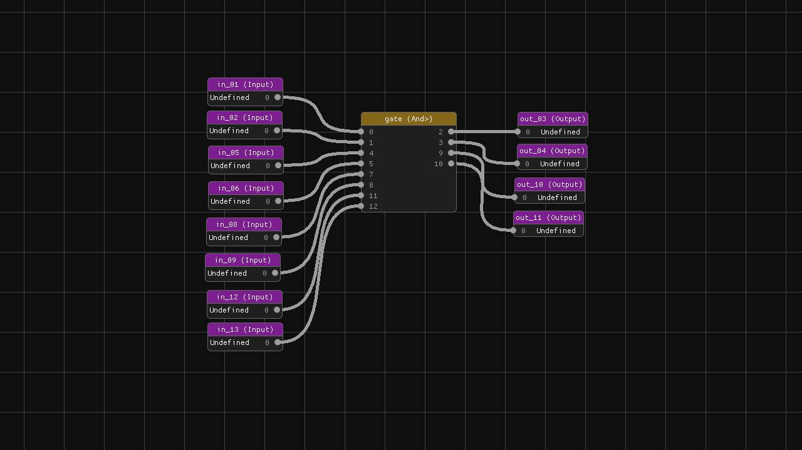

# ⚡ NanoTekSpice

**NanoTekSpice** is a digital circuit simulator that allows you to build
and simulate logic circuits using various components like logic gates,
flip-flops, and other integrated circuits.

## 📌 Table Of Content

- [⚙️ Installation](#️-installation)
- [✨ Features](#-features)
- [🖼️ Gallery](#-gallery)
- [📄 Documentation](#-documentation)
- [🔗 Dependencies](#-dependencies)
- [📂 Sources](#-sources)
- [👥 Authors](#-authors)
- [📜 License](#-license)

## ⚙️ Installation

1. Clone the repository
2. Compile the project using the Makefile

```sh
make
```

3. Run the simulator

```sh
./nanotekspice [circuit_file]
```

4. (Optional) To build the bonus

```sh
make fclean bonus
./nanotekspice
```

## ✨ Features

* Simulation of digital logic circuits
* Support for various components:
    * Basic logic gates (AND, OR, NOT, etc.)
    * Flip-flops and memory components
    * Input/output components
* Interactive shell for controlling the simulation
* Visual representation of circuit states
* Real-time circuit manipulation

## 🖼️ Gallery



## 📄 Documentation

The circuits are described in configuration files (.nts) found in the Circuits directory.

Available commands in simulator mode:

- `display`: Display the current state of pins
- `simulate`: Simulate a clock tick
- `loop`: Run simulation continuously
- `exit`: Exit the program

For detailed component specifications and examples, please refer to the Documentations directory.

## 🔗 Dependencies

- C++ compiler supporting C++20
- [SFML](https://www.sfml-dev.org/fr/) (Simple and Fast Multimedia Library) for graphical interface

## 📂 Sources

The project is organized as follows:

- `Bonus`: The base for the bonus visual editor
- `Circuits`: Circuit definition files (.nts)
- `Components`: Base implementation of circuit components
- `Documentations`: Documentation for components
- `Errors`: Custom error exception
- `External`: External libraries such as SFML and ImGui
- `Gates`: Basic implementation of logical gates
- `Sequencials`: Basic implementation of sequencial component
- `Shell`: Command interface implementation
- `Specials`: Specials components such as Input/Output
- `Tests`: Test cases for the project

## 👥 Authors

_TekyoDrift Team_

- [🐵 Mallory SCOTTON](https://github.com/mallory-scotton) _(Project Leader)_
- [🙉 Hugo CATHELAIN](https://github.com/Hugo-Cathelain)

## 📜 License

MIT License

Copyright (c) 2025 TekyoDrift

Permission is hereby granted, free of charge, to any person obtaining a copy of this software and associated documentation files (the "Software"), to deal in the Software without restriction, including without limitation the rights to use, copy, modify, merge, publish, distribute, sublicense, and/or sell copies of the Software, and to permit persons to whom the Software is furnished to do so, subject to the following conditions:

The above copyright notice and this permission notice shall be included in all copies or substantial portions of the Software.

THE SOFTWARE IS PROVIDED "AS IS", WITHOUT WARRANTY OF ANY KIND, EXPRESS OR IMPLIED, INCLUDING BUT NOT LIMITED TO THE WARRANTIES OF MERCHANTABILITY, FITNESS FOR A PARTICULAR PURPOSE AND NONINFRINGEMENT. IN NO EVENT SHALL THE AUTHORS OR COPYRIGHT HOLDERS BE LIABLE FOR ANY CLAIM, DAMAGES OR OTHER LIABILITY, WHETHER IN AN ACTION OF CONTRACT, TORT OR OTHERWISE, ARISING FROM, OUT OF OR IN CONNECTION WITH THE SOFTWARE OR THE USE OR OTHER DEALINGS IN THE SOFTWARE.
