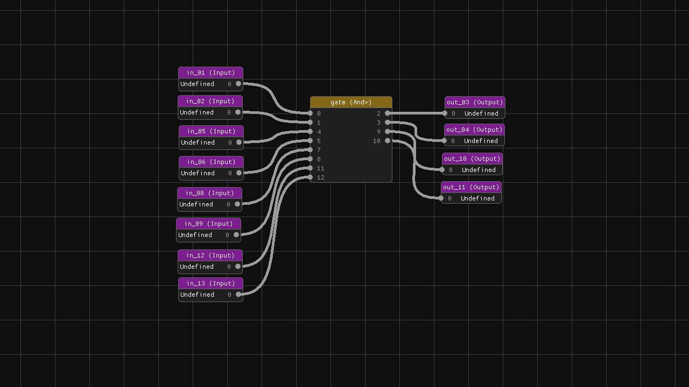
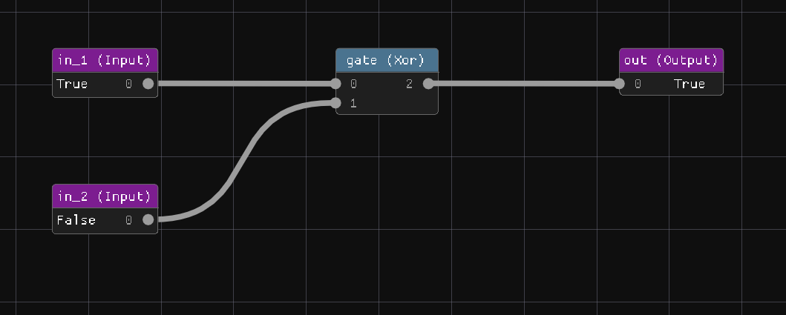

# ⚡ NanoTekSpice

[](https://opensource.org/licenses/MIT)
[](https://isocpp.org/)
[]()

**NanoTekSpice** is a sophisticated digital circuit simulator designed for educational and professional use. Built in C++20, it provides a comprehensive platform for designing, building, and simulating complex logic circuits using various digital components including logic gates, flip-flops, counters, memory units, and specialized integrated circuits.

## 📋 Table of Contents

- [🔍 Project Overview](#-project-overview)
- [✨ Features](#-features)
- [🖼️ Gallery](#️-gallery)
- [⚙️ Installation](#️-installation)
- [🚀 Usage](#-usage)
- [🔧 Build Instructions](#-build-instructions)
- [🔗 Dependencies](#-dependencies)
- [📂 Project Structure](#-project-structure)
- [📄 Documentation](#-documentation)
- [🤝 Contributing](#-contributing)
- [📜 License](#-license)
- [📞 Contact](#-contact)

## 🔍 Project Overview

NanoTekSpice is an advanced digital circuit simulator that implements a comprehensive set of digital logic components following industry standards. The project features both a command-line interface for scripted simulations and an optional graphical interface for visual circuit design and real-time manipulation.

### Key Highlights

- **Educational Focus**: Perfect for learning digital logic and circuit design principles
- **Industry-Standard Components**: Implements real IC specifications (74xx series, 40xx series)
- **Tristate Logic**: Full support for high-impedance states and undefined logic levels
- **Modular Architecture**: Clean, extensible codebase following modern C++ practices
- **Cross-Platform**: Supports Linux distributions with comprehensive dependency management

## ✨ Features

### Core Simulation Engine
- **Tristate Logic System**: Complete implementation of TRUE, FALSE, and UNDEFINED states
- **Cycle-Accurate Simulation**: Precise timing simulation with clock-based operations
- **Signal Propagation**: Intelligent signal propagation with cycle detection
- **Real-Time Debugging**: Step-by-step simulation with state inspection

### Supported Components

#### Basic Logic Gates
- **AND, OR, NOT, NAND, NOR, XOR**: Fundamental logic operations
- **Quad Gates**: 4-gate packages (4001, 4011, 4071, 4081, 4030)

#### Memory & Storage
- **Flip-Flops**: D-type and JK flip-flops with set/reset functionality
- **Counters**: Binary and Johnson counters (4017, 4040)
- **RAM/ROM**: 4801 RAM and 2716 EPROM implementations

#### Specialized ICs
- **4008**: 4-bit binary full adder with carry
- **4013**: Dual D-type flip-flop
- **4069**: Hex inverter
- **4094**: 8-bit shift register
- **4512**: 8-channel data selector
- **4514**: 4-to-16 line decoder

#### Input/Output Components
- **Interactive Inputs**: Manual input control and clock generators
- **Output Displays**: State visualization and logging capabilities
- **Constants**: TRUE/FALSE constant generators

### Advanced Features
- **Interactive Shell**: Command-line interface with live simulation control
- **Circuit Loading**: Support for .nts circuit definition files
- **Visual Editor** (Bonus): Drag-and-drop circuit design with ImGui/SFML
- **Batch Processing**: Automated testing and validation systems
- **Matrix Display**: LED matrix visualization for complex outputs

## 🖼️ Gallery

### Basic Logic Gates

*Interactive logic gate simulation with real-time state visualization*

### Complex Circuit Example

*4-input AND gate implementation using multiple IC components*

### XOR Gate Implementation

*XOR gate circuit design showing pin connections and signal flow*

### Visual Editor (Bonus)

*Advanced visual editor with matrix display capabilities*

## ⚙️ Installation

### Prerequisites
- **Operating System**: Linux (Ubuntu 18.04+, Fedora 30+, or equivalent)
- **Compiler**: GCC 10+ or Clang 12+ with C++20 support
- **Build System**: GNU Make
- **Version Control**: Git

### Quick Start

1. **Clone the Repository**
   ```bash
   git clone https://github.com/mallory-scotton/nanotekspice.git
   cd nanotekspice
   ```

2. **Install Dependencies**
   ```bash
   make deps
   ```
   *Automatically detects and installs required packages for your distribution*

3. **Build the Project**
   ```bash
   make
   ```

4. **Run Your First Simulation**
   ```bash
   ./nanotekspice Circuits/and.nts
   ```

### Building the Visual Editor (Bonus)

```bash
make fclean bonus
./nanotekspice
```

## 🚀 Usage

### Command Line Interface

**Basic Simulation:**
```bash
./nanotekspice <circuit_file.nts>
```

**Available Commands in Simulator:**
- `display` - Show current state of all outputs
- `simulate` - Execute one clock cycle
- `loop` - Run continuous simulation
- `<input>=<value>` - Set input values (0, 1, or U for undefined)
- `exit` - Terminate simulation

**Example Session:**
```bash
$ ./nanotekspice Circuits/and.nts
> a=1
> b=1
> simulate
> display
s: 1
> exit
```

### Circuit Definition Files (.nts)

NanoTekSpice uses a simple text format for circuit definitions:

```
# Example: Simple AND gate
.chipsets:
and a

.links:
a:1 input_a
a:2 input_b
a:3 output_s

.inputs:
input_a
input_b

.outputs:
output_s
```

### Visual Editor

Launch the visual editor without arguments to access the graphical interface:
```bash
./nanotekspice
```

Features include:
- Drag-and-drop component placement
- Visual wire routing
- Real-time simulation
- Component property editing
- Circuit export to .nts format

## 🔧 Build Instructions

### Makefile Targets

| Target | Description |
|--------|-------------|
| `make` or `make build` | Build the standard CLI version |
| `make debug` | Build with debug symbols (-g3) |
| `make bonus` | Build the visual editor with SFML/ImGui |
| `make clean` | Remove object files |
| `make fclean` | Remove all build artifacts |
| `make re` | Clean rebuild |
| `make deps` | Install system dependencies |

### Compilation Flags

- **Standard**: `-std=c++20 -Wall -Wextra`
- **Debug**: Additional `-g3` flag
- **Bonus**: Includes SFML static libraries and ImGui integration

### Custom Build Configuration

For advanced users, you can modify the Makefile variables:
```makefile
CXX = g++                    # Compiler (g++, clang++)
CXXFLAGS = -std=c++20 -Wall  # Compilation flags
TARGET = nanotekspice        # Executable name
```

## 🔗 Dependencies

### Core Dependencies
- **C++20 Compiler**: GCC 10+ or Clang 12+
- **GNU Make**: Build system
- **Standard Library**: Full C++20 STL support

### Visual Editor Dependencies (Bonus)
- **SFML 2.5+**: Graphics, window management, and audio
- **ImGui**: Immediate mode GUI framework
- **System Libraries**:
  - OpenGL
  - X11, Xrandr, Xcursor, Xinerama, Xi
  - FreeType, FLAC, Vorbis, OGG
  - udev, zlib

### Automatic Dependency Installation

The project includes automatic dependency management:
```bash
make deps  # Detects your package manager and installs dependencies
```

Supported package managers:
- **APT** (Ubuntu, Debian): `libsfml-dev`, `libglfw3-dev`, etc.
- **DNF** (Fedora, RHEL): `sfml-devel`, `mesa-libGL-devel`, etc.

## 📂 Project Structure

```
nanotekspice/
├── 📁 Bonus/              # Visual editor implementation
│   ├── Bonus.cpp/hpp     # Main GUI application
│   ├── Matrix.cpp/hpp    # LED matrix visualization
│   └── DigitalInput.cpp/hpp # Multi-bit input components
├── 📁 Components/         # Integrated circuit implementations
│   ├── C2716.cpp/hpp     # 2716 EPROM
│   ├── C4008.cpp/hpp     # 4-bit binary adder
│   ├── C4013.cpp/hpp     # Dual D flip-flop
│   └── ...               # Additional IC components
├── 📁 Gates/              # Basic logic gate implementations
│   ├── And.cpp/hpp       # AND gate
│   ├── Or.cpp/hpp        # OR gate
│   └── ...               # Other basic gates
├── 📁 Sequencials/        # Sequential logic components
│   ├── FlipFlop.cpp/hpp  # Generic flip-flop implementation
│   └── Counter.cpp/hpp   # Counter components
├── 📁 Specials/           # Special I/O components
│   ├── Input.cpp/hpp     # Manual input control
│   ├── Output.cpp/hpp    # Output display
│   └── Clock.cpp/hpp     # Clock generator
├── 📁 Shell/              # Command-line interface
│   ├── Shell.cpp/hpp     # Interactive shell
│   ├── Parser.cpp/hpp    # Circuit file parser
│   └── Circuit.cpp/hpp   # Circuit container
├── 📁 Errors/             # Exception hierarchy
├── 📁 External/           # Third-party libraries
│   ├── SFML/             # Graphics library
│   └── ImGui/            # GUI framework
├── 📁 Circuits/           # Example circuit definitions
├── 📁 Documentations/     # Component specifications
├── 📁 Tests/              # Unit tests
└── Core Files
    ├── AComponent.cpp/hpp # Abstract component base
    ├── Pin.cpp/hpp       # Pin management
    ├── Tristate.cpp/hpp  # Tristate logic system
    ├── Factory.cpp/hpp   # Component factory
    └── Main.cpp          # Application entry point
```

## 📄 Documentation

### Component Specifications
Detailed PDF documentation for each IC component is available in the `Documentations/` directory:
- Logic gate truth tables and timing diagrams
- Pin configurations and electrical characteristics
- Usage examples and circuit integration guides

### Circuit Examples
The `Circuits/` directory contains numerous example circuits:
- Basic gate combinations
- Complex IC demonstrations
- Educational examples for learning digital logic

### API Reference
For developers extending NanoTekSpice:
- `IComponent`: Component interface specification
- `AComponent`: Abstract base class implementation
- `Tristate`: Three-state logic system
- `Pin`: Connection and signal management

## 🤝 Contributing

We welcome contributions from the community! Please read our [Contributing Guidelines](CONTRIBUTING.md) before getting started.

### Development Process

1. **Fork the Repository**
2. **Create a Feature Branch**
   ```bash
   git checkout -b feature/your-feature-name
   ```
3. **Follow Code Standards**
   - C++20 best practices
   - Consistent naming conventions
   - Comprehensive documentation
4. **Test Your Changes**
   ```bash
   make test  # Run test suite
   ```
5. **Submit a Pull Request**

### Code of Conduct
This project adheres to a strict code of conduct. Please review our guidelines to ensure a welcoming environment for all contributors.

### Reporting Issues
- Use GitHub Issues for bug reports
- Include system information and error messages
- Provide minimal reproduction steps

## 📜 License

This project is licensed under the MIT License - see the [LICENSE.md](LICENSE.md) file for complete details.

```
MIT License

Copyright (c) 2025 TekyoDrift

Permission is hereby granted, free of charge, to any person obtaining a copy
of this software and associated documentation files (the "Software"), to deal
in the Software without restriction, including without limitation the rights
to use, copy, modify, merge, publish, distribute, sublicense, and/or sell
copies of the Software, and to permit persons to whom the Software is
furnished to do so, subject to the following conditions:

The above copyright notice and this permission notice shall be included in all
copies or substantial portions of the Software.
```

## 📞 Contact

**Project Maintainer**: Mallory SCOTTON  
**Email**: mscotton.pro@gmail.com  
**GitHub**: [@mallory-scotton](https://github.com/mallory-scotton)

**Development Team**: TekyoDrift  
- [🐵 Mallory SCOTTON](https://github.com/mallory-scotton) _(Project Leader)_
- [🙉 Hugo CATHELAIN](https://github.com/Hugo-Cathelain) _(Core Developer)_

For technical support, feature requests, or collaboration opportunities, please don't hesitate to reach out!

---

<div align="center">

**NanoTekSpice** - *Coded with ❤️ by the TekyoDrift Team*

*Empowering digital circuit education through innovative simulation technology*

</div>
